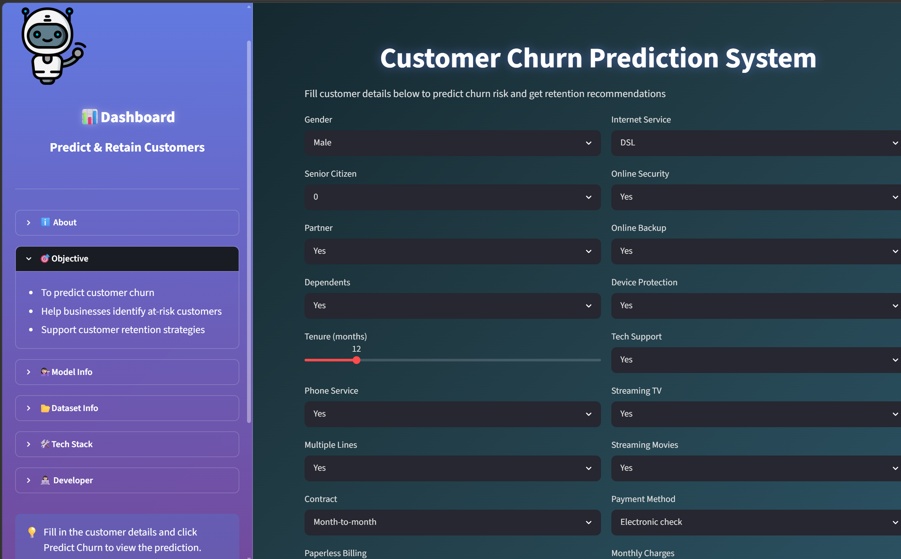
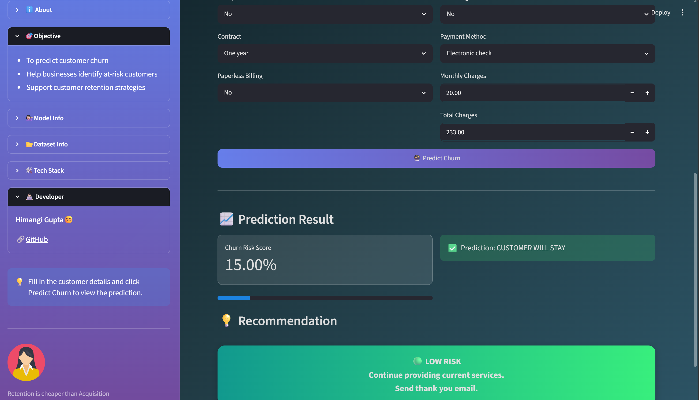

# 📊 Customer Churn Prediction System

A Machine Learning web application that predicts whether a customer is likely to churn or continue using a company's services. Built with Streamlit and Random Forest Classifier.

## 🎯 Objective
- Predict customer churn accurately
- Help businesses identify at-risk customers  
- Support customer retention strategies with actionable recommendations

## ✨ Features
- **Real-time Prediction**: Enter customer details and get instant churn prediction
- **Risk Score & Progress Bar**: Visual gauge showing churn probability %
- **Smart Recommendations**: 
    - 🟢 Low Risk: Continue current services
    - 🟡 Medium Risk: Offer loyalty rewards
    - 🔴 High Risk: Contact customer + offer discounts
- **Attractive UI**: Gradient background, glassmorphism sidebar, animated elements
- **Detailed Insights**: About churn, model info, and tech stack in sidebar

## 🛠️ Tech Stack
- **Frontend**: Streamlit
- **Backend**: Python
- **Libraries**:
    - ✅ Pandas
    - ✅ NumPy  
    - ✅ Scikit-learn
    - ✅ Streamlit
    - ✅ Pickle

## 🤖 Model Info
- **Problem Type**: Binary Classification
- **Algorithm**: ✅ Random Forest Classifier
- **Dataset**: Telco Customer Churn - Kaggle
- **Target Variable**: Churn (Yes/No)
- **Evaluation Metrics**:
    - ✅ Accuracy Score
    - ✅ Confusion Matrix
    - ✅ Classification Report
    - ✅ Precision
    - ✅ Recall
    - ✅ F1-Score
- **Accuracy**: ~85%

## 📂 Dataset
The dataset contains customer information including:
- Demographics: Gender, SeniorCitizen, Partner, Dependents
- Service details: PhoneService, InternetService, OnlineSecurity, TechSupport, etc.
- Account info: Contract, PaymentMethod, MonthlyCharges, TotalCharges, Tenure

## 🚀 How to Run

 **Clone the repository**
```bash
git clone https://github.com/kanak2349299/customer-churn-predictor.git
cd customer-churn-predictor

## 📸 Screenshots

| Dashboard | Prediction Result |
| --- | --- |
|  |  |

## 🔮 Future Improvements
- Add SHAP explainability to show why customer will churn
- Deploy on Streamlit Cloud / HuggingFace Spaces

## 📬 Connect with me
Feel free to reach out for collaborations!